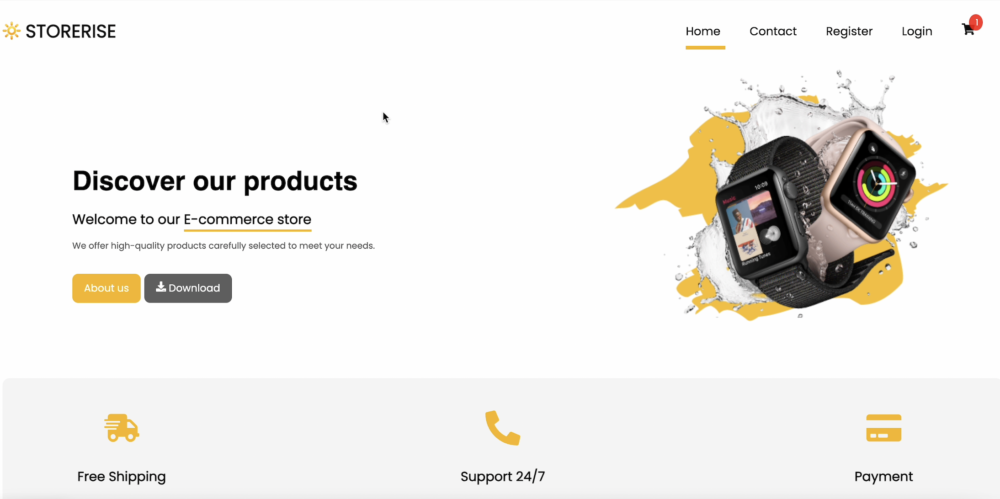

# E-commerce Management System App

Welcome to the E-commerce Management System App, a powerful and intuitive web application built with React.js using Vite. This app utilizes React, TypeScript, Redux/Redux Toolkit for state management, and CSS/SASS for styling.

## Table of Contents
1. [Introduction](#introduction)
2. [Data Sources](#data-sources)
3. [Pages](#pages)
   - [Home Page](#home-page)
   - [Product Page](#product-page)
   - [Admin Page](#admin-page)
4. [Functionalities](#functionalities)
   - [For Visitors](#for-visitors)
   - [For Admins](#for-admins)
5. [Authentication](#authentication)
6. [Form Validation](#form-validation)
7. [Tasks](#tasks)

## Introduction

This E-commerce Management System App is designed to provide a seamless shopping experience. Whether you're a visitor looking to explore products or an admin managing the store, this app caters to your needs.

## Data Sources

The app manages various data sources:

- **Products**: id, name, description, categories, variants, sizes
- **Categories**: id, name
- **Orders**: id, productId, userId, purchasedAt
- **Users**: id, firstName, lastName, email, password, role (visitor or admin)

## Pages

### Home Page

The home page displays a list of all products. Visitors can filter products by categories or price, search products by name, add products to a cart, and remove products from a cart.

### Product Page

This page contains detailed information about a product, allowing users to explore its features and make informed decisions.

### Admin Page

Admins have access to additional functionalities:

- Add a new product
- Update product information
- Remove a product
- List all users and delete/block a user
- List all orders
- Add a new category
- Update category information
- Remove a category

## Functionalities

### For Visitors

- The visitor can get a list of products
- The visitor can Filter products by categories or price
- The visitor can Search products by name
- The visitor can add products to a cart
- The visitor can remove products from a cart

### For Admins

- Add a new product
- Update info of a product
- Remove a product
- List all users and delete/block a user
- List all orders
- Add a new category
- Update info of a category
- Remove a category

## Authentication

- I've implement register and login functionality via email and password
- Protect routes based on login and admin status

## Form Validation

I've emplement form validation to ensure data integrity and enhance the user experience.

## Another functionalities

- Display messages for loading, success, and error scenarios (e.g., when loading the product list or adding a new product)
- I've implement pagination feature
- I've create a Profile Page (available only when the user logs in)
- I've implement editing user profile feature (allow users to change first name and last name)

## How to Run the Code

To run the E-commerce Management System App locally, follow these steps:

### Prerequisites

Make sure you have the following installed:

- [Node.js](https://nodejs.org/)
- [npm](https://www.npmjs.com/) (Node Package Manager)

### Clone the Repository

There are some npm-scripts to help you to run the code.
- npm install
- npm run dev

Feel free to explore, contribute, and enhance the E-commerce Management System App.